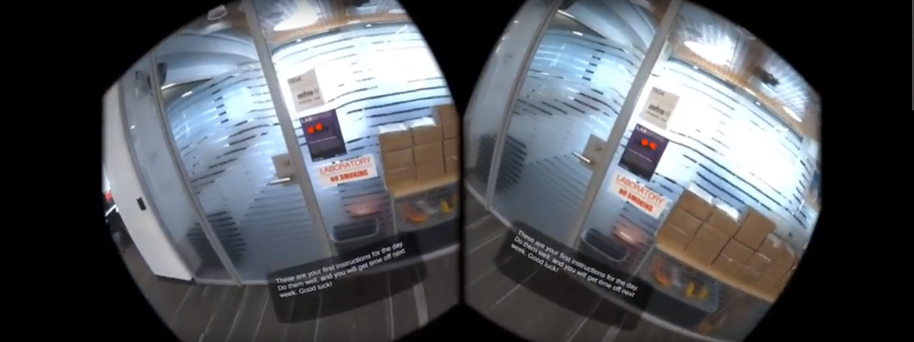
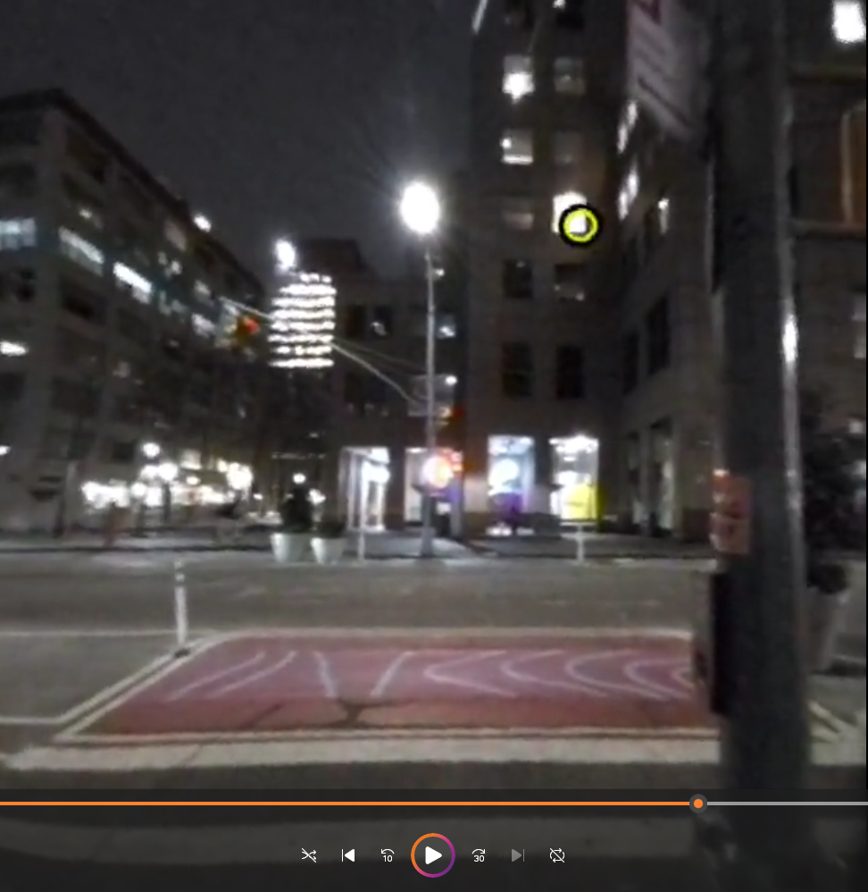
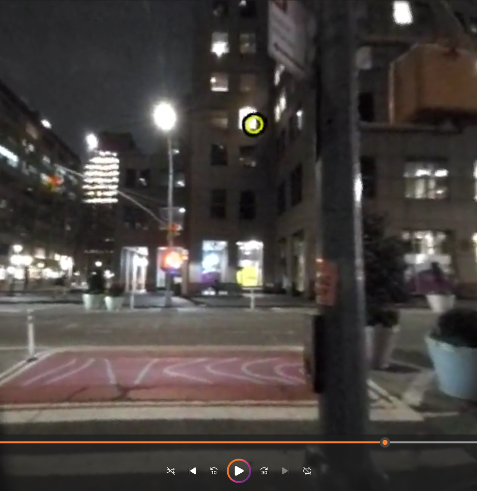

# Meta Quest Pro Lens Correction

_A miniature project to find a way to correct the artificial lens distortion generated by the Meta Quest Pro when recording using `scrcpy` and `ffmpeg`._

This project assumes you have collected raw screen footage from a Meta Quest Pro or other Android-based head-mounted display (HMD) virtual/augmented reality headset. If not, we have a toolkit offered [here for the Meta Quest Pro](git@github.com:SimpleDevs-AR-VR/Meta-Quest-Pro-SCRCPY.git).

If you have a Quest Pro but don't have to toolset to track the eyes, we have provided a repository containing a Unity project that'll get you started: [https://github.com/SimpleDevs-AR-VR/PassthroughData.git](https://github.com/SimpleDevs-AR-VR/PassthroughData.git). Just make sure to use the `main` branch!

[](https://youtu.be/zhfMPfGJFuc)

## Step 1: Correct Lens Distortion in VR footage.

When we begin to process the raw captured footage using SCRCPY, we must separate the left and right eye footage streams provided in the raw SCRCPY footage and correct for the artificial distortion introduced. = We can attempt to perform a kind of lens correction using FFMPEG. The necessary steps are the following:

1. Crop the video so that left and right eye footage are separated into their own separate files.
2. Rotate the images so that they are as close to horizontal as possible.
3. Perform lens distortion correction to reduce the "fisheye" effect seen in the original footage for each eye.

* **NOTE:** This is explicitly with regard to when recording with `m1280` when recordign with **scrcpy**.
* **NOTE:** Please ensure that you have `-vsync 2` included as an argument passed to the **ffmpeg** command, as this ensures that all video processing occurs quickly.

### LEFT EYE

````bash
ffmpeg -i <INPUT_VIDEO_FILE> -vf "crop=632:672:16:0,rotate=21*(PI/180),lenscorrection=cx=0.57:cy=0.51:k1=-0.48:k2=0.2" -vsync 2 <OUTPUT_VIDEO_FILE>.mp4
````

### RIGHT EYE

````bash
ffmpeg -i <INPUT_VIDEO_FILE> -vf "crop=632:672:648:0,rotate=-21*(PI/180),lenscorrection=cx=0.43:cy=0.51:k1=-0.48:k2=0.2" -vsync 2 <OUTPUT_VIDEO_FILE>.mp
````

## Example

### Original:


### After Correction:

|Left|Right|
|:-:|:-:|
|||

## Parameters for Correction

To learn more about each process, please refer to the following documentation provided in `docs/`:

* [**Cropping Parameters**](./docs/CROPPING.md)
* [**Rotation Parameters**](./docs/ROTATION.md)
* [**Lens Correction Parameter**](./docs/LENS_CORRECTION.md)

## Eye Cursor Estimation

In addition to correcting the footage, a good idea is to overlay the original footage with an estimation of the eye cursor's position relative to the footage. We didn't visualize the cursor in our footage originally because it would interfere with the user's experience with the simulation.

### Defining the Transformation Matrix

The process saw that we attempt to form a transformation matrix that represents the skew, scale, and translation issues when converting from the raw footage coordinates to the lens-corrected coordinates. This was solved using a system of linear equations involving four points whom we know the positions of in both the raw footage and the corrected footage. We actually solved this already; the mapping and transformation matrix is provided in `template/mappings/`, of which there are four types:

|Template Filename|Anchor distance from head|Eye target max distance|
|:-:|:-:|:-:|
|`a10-e10.json`|10 (virtual) meters|10 (virtual) meters|
|`a10-e50.json`|10 (virtual) meters|50 (virtual) meters|
|`a50-e10.json`|50 (virtual) meters|10 (virtual) meters|
|`a50-e50.json`|50 (virtual) meters|50 (virtual) meters|

The anchor distances refer to how far away the template anchors were from the users' head when the scene first loads in. The eye target max distance refers to the distance at which the raycasts outward from the estimated gaze directions end at. Depending on how you organize these two, you can use whichever mappings you are most comfortable with.

If you need to generate your own mappings (i.e. you used your own unique anchors), you can perform the following steps:

1. Your VR simulation must have several frames where each of your 4 anchors are independently rendered (i.e. they're presented in a sequence, each only visible by itself). You can extract the frames from your footage using `src/GetScreenshotFromVideo.py`. Save them in a directory and name them individually as `center.png`, `topleft.png`, `topright.png`, and `bottomleft.png`. Make sure to use the same template image for all anchors (i.e. you use the same)
2. Execute `python src/FindAnchorMapping.py [root_dir] [template_image_filename] [json_output_filename]`. This script is designed to identify where a template anchor is present in the captured raw footage but requires the four snapshots from Step 1 to work. It wil attempt to identify where the template is present in each image, look at the `vr.csv` file located in `[root_dir]` to identify where the equivalent point is in the world-to-screen 2D point, and use the system of linear equations formed from aggregating four anchor points to identify the transformation matrix.

### Estimating the Eye Cursor Position

Once you have your `mappings.json` (or whatever you named it as), you should be able to estimate the eye position in the captured footage based on `vr.csv`. You can do this by executing the following command:

````bash
python src/EstimateEyeCursor2.py [source_footage (video)] [VR events (csv)] [mapping file (json)] [output directory] -ofs [Offset from the beginning, in seconds] -outf [Output filename of the generated video]

## Example w/ no output filename
python src/EstimateEyeCursor2.py ./sample3/left.mp4 ./sample3/eeg_events.csv ./template/mappings/a50-e50.json ./sample3/outputs/ -ofs 15.0
````

This will, if given the proper parameters, will successfully overlay the cursor on top of the original footage.


---
---

# DEPRECATED INSTRUCTIONS

## Extracting Frame Timestamps

When we begin to process the raw captured footage using SCRCPY, we begin to modify the frame rate of any outputted videos processed by OpenCV-Python. This means that the timing of videos gets mixed up and potentially mutated. To avoid this, we need a record of the actual timestamp of each frame.

We can do this with the following script: `src/ExtractFrameTimestamps.py`. This script uses `ffprobe` to extract that data for each frame, and this script ensure that the output from the `ffprobe` command is saved in a CSV file.

The necessary command to execute the script is thus:

````bash
python src/ExtractFrameTimestamps.py <path/to/raw/footage.mp4> -of <OFFSET (sec)>
````

The output will be saved in a folder in he same relative directory as the raw footage file, with the folder name set as "<original_filename>_timestamps/". The outputted files are:

* `frame_timestamps.csv`: the CSV file containing the timestamps for each frame
* `timestamp_deltas.png`: a graph that shows how the time between frames fluctuates. If your original footage is at a constant frame rate, you will see the deltas 1) be small in value, and 2) maintain a consistent pattern in the graph. If your original footage is at a variable frame rate, you'll see the graph shift and have deltas that are somewhat significant.

## Correcting for Distortion

We have two separate footage streams condensed into one single video, complete with artificial distortion.


We want to attempt to correct for this artificial distortion so that we can begin to derive good footage of our AR/VR application in action. We can attempt to perform a kind of lens correction using FFMPEG.

The necessary steps are the following:

1. Crop the video so that left and right eye footage are separated into their own separate files.
2. Rotate the images so that they are as close to horizontal as possible.
3. Perform lens distortion correction to reduce the "fisheye" effect seen in the original footage for each eye.

## Commands and Parameters

**NOTE:** This is explicitly with regard to when recording with `m1280` when recordign with **scrcpy**.

**NOTE:** Please ensure that you have `-vsync 2` included as an argument passed to the **ffmpeg** command, as this ensures that all video processing occurs quickly.

### LEFT EYE

````bash
ffmpeg -i <INPUT_VIDEO_FILE> -vf "crop=632:672:16:0,rotate=21*(PI/180),lenscorrection=cx=0.57:cy=0.51:k1=-0.48:k2=0.2" -vsync 2 <OUTPUT_VIDEO_FILE>.mp4
````

### RIGHT EYE

````bash
ffmpeg -i <INPUT_VIDEO_FILE> -vf "crop=632:672:648:0,rotate=-21*(PI/180),lenscorrection=cx=0.43:cy=0.51:k1=-0.48:k2=0.2" -vsync 2 <OUTPUT_VIDEO_FILE>.mp
````

## Example

### Original:


### After Correction:

|Left|Right|
|:-:|:-:|
|||

## Parameters for Correction

To learn more about each process, please refer to the following documentation provided in `docs/`:

* [**Cropping Parameters**](./docs/CROPPING.md)
* [**Rotation Parameters**](./docs/ROTATION.md)
* [**Lens Correction Parameter**](./docs/LENS_CORRECTION.md)

---

## Eye Cursor Estimation

In addition to correcting the footage, a good idea is to overlay the original footage with an estimation of the eye cursor's position relative to the footage. We didn't visualize the cursor in our footage originally because it would interfere with the user's experience with the simulation.

### Defining the Transformation Matrix

The process saw that we attempt to form a transformation matrix that represents the skew, scale, and translation issues when converting from the raw footage coordinates to the lens-corrected coordinates. This was solved using a system of linear equations involving four points whom we know the positions of in both the raw footage and the corrected footage. We actually solved this already; the mapping and transformation matrix is provided in `template/mappings/`, of which there are four types:

|Template Filename|Anchor distance from head|Eye target max distance|
|:-:|:-:|:-:|
|`a10-e10.json`|10 (virtual) meters|10 (virtual) meters|
|`a10-e50.json`|10 (virtual) meters|50 (virtual) meters|
|`a50-e10.json`|50 (virtual) meters|10 (virtual) meters|
|`a50-e50.json`|50 (virtual) meters|50 (virtual) meters|

The anchor distances refer to how far away the template anchors were from the users' head when the scene first loads in. The eye target max distance refers to the distance at which the raycasts outward from the estimated gaze directions end at. Depending on how you organize these two, you can use whichever mappings you are most comfortable with.

If you need to generate your own mappings (i.e. you used your own unique anchors), you can perform the following steps:

1. Your VR simulation must have several frames where each of your 4 anchors are independently rendered (i.e. they're presented in a sequence, each only visible by itself). You can extract the frames from your footage using `src/GetScreenshotFromVideo.py`. Save them in a directory and name them individually as `center.png`, `topleft.png`, `topright.png`, and `bottomleft.png`. Make sure to use the same template image for all anchors (i.e. you use the same)
2. Execute `python src/FindAnchorMapping.py [root_dir] [template_image_filename] [json_output_filename]`. This script is designed to identify where a template anchor is present in the captured raw footage but requires the four snapshots from Step 1 to work. It wil attempt to identify where the template is present in each image, look at the `vr.csv` file located in `[root_dir]` to identify where the equivalent point is in the world-to-screen 2D point, and use the system of linear equations formed from aggregating four anchor points to identify the transformation matrix.

### Estimating the Eye Cursor Position

Once you have your `mappings.json` (or whatever you named it as), you should be able to estimate the eye position in the captured footage based on `vr.csv`. You can do this by executing the following command:

````bash
python src/EstimateEyeCursor [source_footage (video)] [VR events (csv)] [mapping file (json)] [timeframe file (csv)] -re [Is this the right eye? Defaults to left eye if not called]

## Example
python src/EstimateEyeCursor.py ./sample/left.mp4 ./sample/10-31-35.csv ./template/mappings/a50-e50.json ./sample/frame_timestamps.csv
````

This will, if given the proper parameters, will successfully overlay the cursor on top of the original footage.