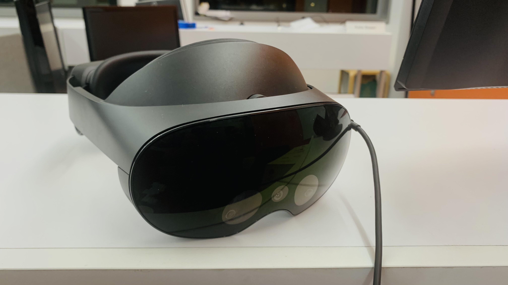
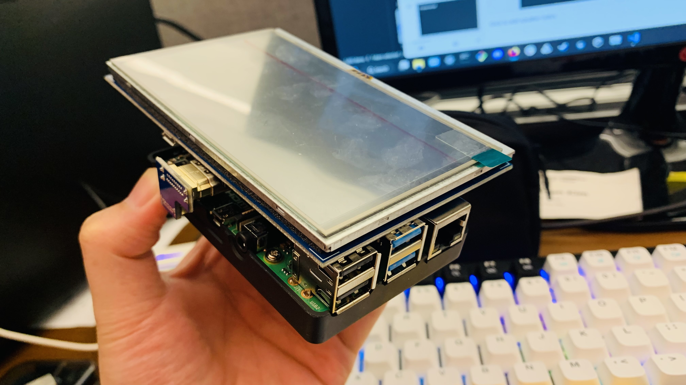
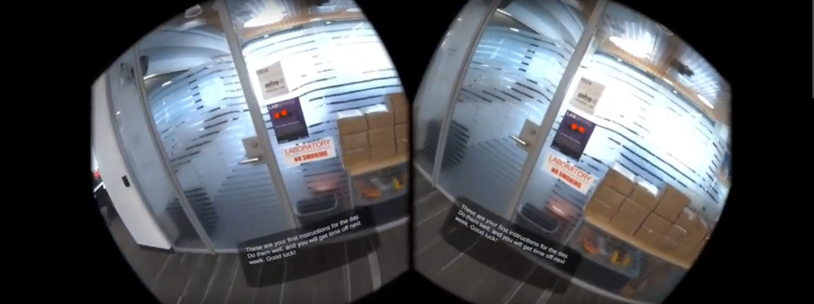
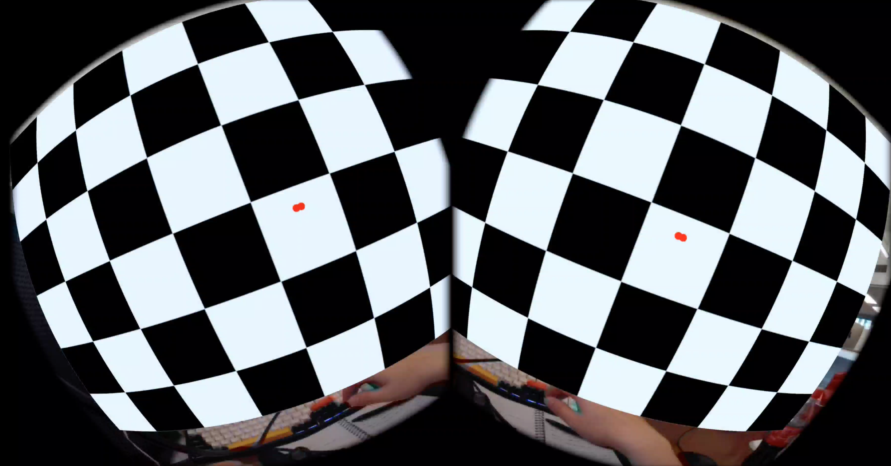
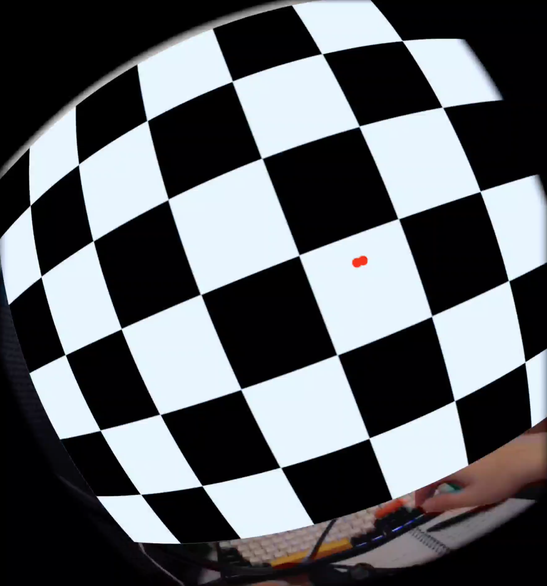
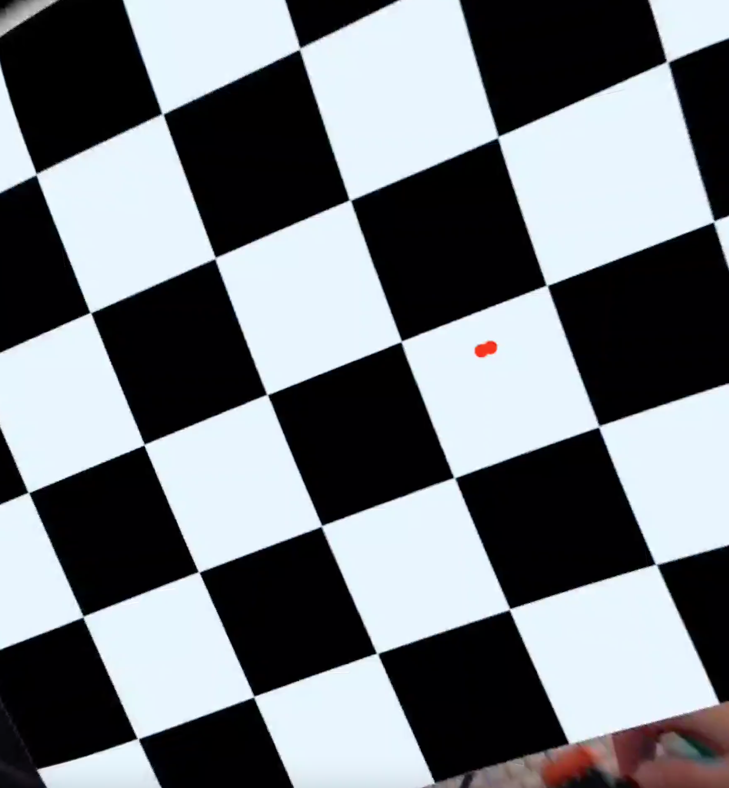
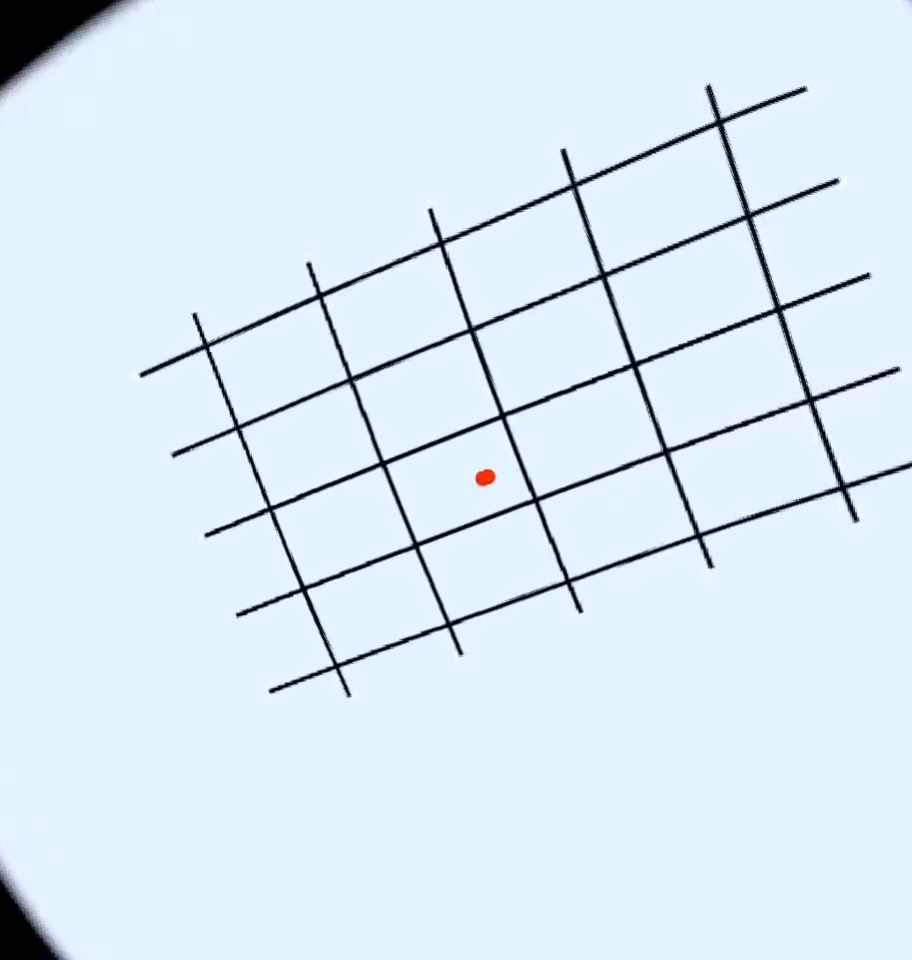

# Meta Quest Pro Lens Correction

_A miniature project to find a way to correct the artificial lens distortion generated by the Meta Quest Pro when recording using `scrcpy` and `ffmpeg`._

_Scroll down to the bottom for overall findings on which parameters to correct the lenses of the Meta Quest Pro._

## Recording Passthrough AR Content for Analysis

There are 3 ways to capture raw footage capture of the passthrough AR camera feed that is shown to users of the Meta Quest Pro HMD:

1. Turn on the Guardian System + in-built video recording.
    * V47 of the Oculus system allows passthrough AR to be recorded, but only when the Guardian is on (which isn’t very conducive to us if we’re doing real-world studies)
2. Use the Oculus mobile application + casting
    * Like the Guardian + in-built video recording, this option is only viable if you are using a Guardian system. This method only views virtual objects only otherwise.
3. Record using SCRCPY
    * Requires an external PC to run - SCRCPY cannot be sideloaded into the Quest Pro like some app nor can it be run within a Unity project
    * The only way we can do this is have the SCRCPY program run on an external system that is connected to the Quest Pro via cable.

To simplify the scenarios, you should follow this general guideline:

||**Stationary**|**Requires Movement**|
|:--|:--|:--|
|**VR**|In-built recording, mobile casting|In-built recording, mobile casting|
|**AR**|In-built recording, mobile casting|SCRCPY|

Therefore, this repository **only concerns the SCRCPY approach**, as the other methods are pretty self-explanatory and are pretty useful on their own.

### Software and Hardware Requirements

The SCRCPY approach requires the following materials

* A PC device capable of running unix bash commands
* The SCRCPY application software
* The Meta Quest Pro HMD
* USB-C connection cable



However, let us assume that you are running a mobile setup - meaning that you cannot maintain a connection to your stationary PC. You will require an alternative option such as some mobile PC. In this case, we suggest the following additional hardware:



* [Rasberry Pi 4](https://www.raspberrypi.com/products/raspberry-pi-4-model-b/) (or some other Ubuntu-compatible equivalent)
    * Battery pack
    * Compatible LED screen - touchscreen recommended
    * Mouse and keyboard for text input (the former if a touchscreen isn't viable)

Make sure [that your miniature PC has Ubuntu installed](https://ubuntu.com/tutorials/how-to-install-ubuntu-desktop-on-raspberry-pi-4#1-overview).

### Recording Setup

This method is compatible with any AR or VR application - it is therefore application-agnostic with regard to what kind of virtual experience you want to capture.

The setup is as follows:

1. Connect a PC with SCRCPY to the HMD
    * You may run into a permissions popup when connecting the system to the HMD. Just make sure to accept all permissions.
2. Activate the AR or VR application of your choice in the HMD.
3. Run the following SCRCPY command in the Rasberry Pi 4: `scrcpy -m1824 --no-display –record <file_location>.mp4`.
    * The recording location where you'll be saving the mp4 file will be up to your discretion. You can even use the filename to record pertinent details about the recording session (i.e. date and time of recording).
    - If we just call `scrcpy –record <filename>.mp4`, the footage will actually lag… a LOT. We need to modify the command with:
        - `--no-display`: doesn't render the footage as-is, which saves on processing runtime) 
        - `-m1824`: caps the maximum resolution to 1824*960. Alternatively, you can also call `-m1080` to cap the resolution to 1080p. Without this command, the footage is captured at a full 1800p.
4. When you are done recording the software, make sure to exit the application via `ctrl + x`.

### Results

[](https://youtu.be/zhfMPfGJFuc)

## Correcting for Distortion

The raw footage collected from the HMD using SCRCPY looks like this (below). We have two separate footage streams condensed into one single video, complete with distortion.


We want to attempt to correct for this artificial distortion so that we can begin to derive good footage of our AR/VR application in action. In other words, in theory, we should find a way to perform the following:

1. Capture the raw footage using SCRCPY.
2. Isolate the image to a single eye view.
3. Reverse the artificial lens distortion to "straighten" the image or video.

### FFMPEG for Lens Correction

We can attempt to perform a kind of lens correction using FFMPEG. Similar to SCRCPY, FFMPEG is a command-line tool that allows users to modify images, videos, audio, and other media-related content. Luckily, FFMPEG comes with a command to correct for lens distortion: literally `lenscorrection=k1=<FLOAT>:k2=<FLOAT>`. Let's use this to our advantage.

The full command to perform lens correction is (for the left eye):

````
ffmpeg <file_location>.mp4 -vf “crop=”1800:1920:50:0,lenscorrection=k1=0.2:k2=-0.5” <output_file>.mp4
````

### Results

1. Capture the raw footage using SCRCPY.

_Original Raw Footage_

2. Isolate the image to a single eye view.

_Cropped, Distorted_

3. Reverse the artificial lens distortion to "straighten" the image or video.

_Cropped, Corrected_


## Executable Scripts

This repository comes with two script files:

* `EstimateDistortion.py`
* `GetScreenshotFromVideo.py`

The 2nd file is purely for debugging. The key star of the show is the 1st file, `EstimateDistortion.py`. This script, when called, produces multiple possible parameters for `k1` and `k2` and visualizes the results for us.

The algorithm for lens correction:

$$
r_{src} = r_{tgt}\left( 1 + k_1\left( \frac{r_{tgt}}{r_0} \right)^2 + k_2 \left( \frac{r_{tgt}}{r_0} \right)^4 \right)
$$

Where:

* $r_{src}$ = the distance to the focal point in the **target** image
* $r_{tgt}$ = distance to focal point in the **source** image
* $r_0$ = half of the image diagonal
* $k_1, k_2$ = hyperparameters for correction

This is implemented through `ffmpeg`’s `lenscorrection` filter, which accepts a `cx`, `cy`, `k1`, and `k2` as hyperparameters.

To call this script, simply execute:

````bash
python EstimateDistortion.py
````

**Please be aware of the following**:

* You must have an empty `inputs`, `processing`, and `output` directories located in the same local directory as the script. The script will not work without these folders present.
* The script, when called, produces multiple possible combinations of `k1` and `k2`. It's YOUR job to look through these and determine what's the best possible combination.
* The total runtime is intense. Make sure you have something you can do in the meantime. Total runtime can range between 10 to 20 minutes.
* This step of the process can be performed in post, meaning you don't need to run this script on the Rasberry Pi 4. You can easily just use the Rasberry Pi 4 for the video recording, then run this part of the pipeline on your more-powerful PC setup.

##  Raw Command List

>````
>scrcpy -m1824 --no-display --record Desktop/<filename>.mp4
>````
>_Outputs a file at max resolution of 1824*960._

>````
>ffmpeg -i Desktop/RLStreetSim/DistortionTest_3648_1920_0_0_1824_NoDisplay.mp4 -vf "crop=912:960:12.5:0" -vsync 2 Desktop/RLStreetSim/DistortionTestLeft.mp4
>````
>_Crops the video to focus on the left eye._

>````
>ffmpeg -i DistortionTestLeft.mp4 -vf "lenscorrection=k2=0.2:k1=-0.5" -vsync 2 DistortionTestLeft_Corrected.mp4
>````
>_The lens correction filter where `k2=0.2` and `k1=-0.5`, as an example._

## Overall Findings

Based on visual observation and testing, I feel confident that the following parameters would be optimal for lens correction:

* `k1: 0.55`
* `k2: 0.3`



---

## Template Crops and Correction Parameters

### -m1080

**CROP**:

````bash
ffmpeg -i <INPUT_VIDEO_PATH> -vf "crop=530:568:15:0" -vsync 2 <OUTPUT_VIDEO_PATH>
````

where:

* `out_w`: The width of the cropped area: `530`
* `out_h`: The height of the cropped area: `568`
* `x`: The x-coordinate of the topleft corner of the cropped area: `15`
* `y`: The y-coordinate of the topleft corner of the cropped area: `0`

**CORRECTION**:

````bash
ffmpeg -i <INPUT_VIDEO_PATH> -vf "lenscorrection=k2=0.3:k1=-0.55" -vsync 2 <OUTPUT_VIDEO_PATH>
````

where:

* `k2`: `0.3`
* `k1`: `-0.55`

### -m1280

````bash
ffmpeg -i <INPUT_VIDEO_PATH> -vf "crop=628:672:18:0" -vsync 2 <OUTPUT_VIDEO_PATH>
````

where:

* `out_w`: The width of the cropped area: `628`
* `out_h`: The height of the cropped area: `672`
* `x`: The x-coordinate of the topleft corner of the cropped area: `18`
* `y`: The y-coordinate of the topleft corner of the cropped area: `0`

**CORRECTION**:

````bash
ffmpeg -i <INPUT_VIDEO_PATH> -vf "lenscorrection=k2=0.3:k1=-0.55" -vsync 2 <OUTPUT_VIDEO_PATH>
````

where:

* `k2`: `0.3`
* `k1`: `-0.55`