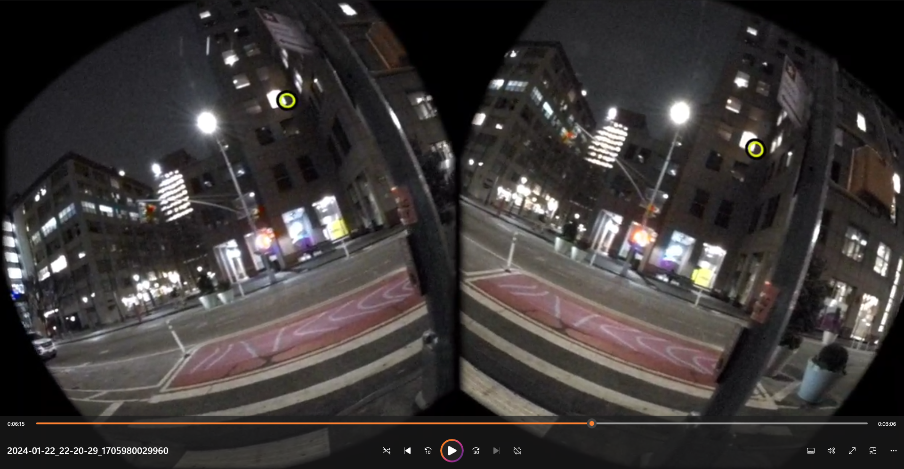

# Meta Quest Pro Lens Correction

_A miniature project to find a way to correct the artificial lens distortion generated by the Meta Quest Pro when recording using `scrcpy` and `ffmpeg`._

This project assumes you have collected raw screen footage from a Meta Quest Pro or other Android-based head-mounted display (HMD) virtual/augmented reality headset. If not, we have a toolkit offered [here for the Meta Quest Pro](git@github.com:SimpleDevs-AR-VR/Meta-Quest-Pro-SCRCPY.git).

[](https://youtu.be/zhfMPfGJFuc)

## Correcting for Distortion

We have two separate footage streams condensed into one single video, complete with artificial distortion.


We want to attempt to correct for this artificial distortion so that we can begin to derive good footage of our AR/VR application in action. We can attempt to perform a kind of lens correction using FFMPEG. Similar to **scrcpy**, **ffmpeg** is a command-line tool that allows users to modify images, videos, audio, and other media-related content. Luckily, **ffmpeg** comes with a command to correct for lens distortion: literally `lenscorrection=k1=<FLOAT>:k2=<FLOAT>`. Let's use this to our advantage.

In addition, it's perhaps more optimal to attempt to look at only a singular eye rather than both eyes. Both eye perspectives are likely to contain similar visual information, and thus it will be simpler to crop the footage to focus on one eye prior to lens correction.

Finally, because the footage is angled at a particular degree from the horizon (approximately 18 degrees), we need to fix that as well.

## Commands and Parameters

If you've used [our method for eye footage capture using **scrcpy**](git@github.com:SimpleDevs-AR-VR/Meta-Quest-Pro-SCRCPY.git), you were provided two options to capture the footage: 

* `-m1080` : 1080 x 568
* `-m1280` : 1280 x 672

Of course, you are completely free to use whichever aspect ratio when recording via **scrcpy**. However, we'll focus on these two specific formats.

The full command to perform lens correction is (for the left eye):

### `-m1080`

````
ffmpeg <file_location>.mp4 -vf "crop=530:568:15:0,lenscorrection=k1=0.3:k2=-0.55,rotate=18*(PI/180)" -vsync 2 <output_file>.mp4
````

### `-m1280`

````
ffmpeg <file_location>.mp4 -vf "crop=628:672:18:0,lenscorrection=k1=0.3:k2=-0.55,rotate=18*(PI/180)" -vsync 2 <output_file>.mp4
````

**NOTE:** Please ensure that you have `-vsync 2` included as an argument passed to the **ffmpeg** command, as this ensures that all video processing occurs quickly.

### Example Process

1. Capture the raw footage using SCRCPY.

_Original Raw Footage_

2. Isolate the image to a single eye view.

_Cropped, Distorted_

3. Reverse the artificial lens distortion to "straighten" the image or video.

_Cropped, Corrected_

## Cropping Hyperparameters

Cropping parameters were determined based on the following process:

1. Determine the black padding on the right side of the raw capture, from the edge of the image to the white background seen in a template image rendered to both eyes.
2. Starting from an equivalent leftmost white background point on the left eye capture, subtract the derived padding to find the mirrored "edge" of the leftmost side.
3. Crop the footage such that the extraneous padding to the left is removed.
4. Calculate the window size of each eye by cropping the altered frame half vertically. Both left and right crops should be equivalent in width and height, as a result.

This can be calculated for ANY aspect ratio raw footage capture from SCRCPY and the Meta Quest Pro. This can be tested by running the python script `FindCropDimensions.py`, which accepts two arguments:

|Command Flag|Argument Type|Value Type|Description|
|:-|:-|:-|:-|
|`source`|positional|`str`|Indicate the relative filepath to an image that must be cropped.|
|`-p`, `--preview`|optional|`bool`|Tell the script if you wish to preview the crop prior to splitting between left and right eye views|

An example command would be:

````bash
python FindCropDimensions.py template/template.png -p True
````

This script uses the **ffmpeg** package for the final cropping. An example of the command and its arguments is as follows:

````bash
ffmpeg -i <INPUT_VIDEO_PATH> -vf "crop=out_x:out_y:x:y" -vsync 2 <OUTPUT_VIDEO_PATH>
````

* `out_w`: The width of the cropped area
* `out_h`: The height of the cropped area
* `x`: The x-coordinate of the topleft corner of the cropped area
* `y`: The y-coordinate of the topleft corner of the cropped area

_**NOTE**: Do NOT forget the `-vsync 2` flag, otherwise your code will take forever._

You can use either `FindCropDimensions.py` or **ffmpeg** to do the cropping for you.

### Cropping Presets

|Format flag|Aspect Ratio|Extra Leftside Padding|Eye Cam Width|Left Eye|Right Eye|
|:-|:-|:-|:-|:-|:-|
|`-m1080`|1080 x 568|?|?|`out_x=534`<br>`out_y=568`<br>`x=12`<br>`y=0`|`out_x=534`<br>`out_y=568`<br>`x=546`<br>`y=0`|
|`-m1280`|1280 x 672|16px|632px|`out_x=632`<br>`out_y=672`<br>`x=16`<br>`y=0`|`out_x=632`<br>`out_y=672`<br>`x=648`<br>`y=0`|

These cropping parameters are provided in `template/template.txt`.

## Rotation Parameters

After cropping, you will perhaps want to rotate each eye such that their horizontal plane is truly horizontal. To do so, one simply has to perform some visual observation to estimate what that rotation amount is for each eye.

Visual analysis shows that each eye is rotated by 21 degrees; the left eye is 21 degrees counter-clockwise, while the right eye is 21 degrees clockwise. To rotate each eye footage back so that the rotation is set to 0, you can use **ffmpeg**. The required command is provided below:

````bash
ffmpeg -i <INPUT_VIDEO_PATH> -vf "rotate=<DEGREES>*(PI/180)" <OUTPUT_VIDEO_PATH>
````

This command will work regardless of the aspect ratio of the original video. The parameters are as such:
|Eye|Degree Amount|Command|
|:-|:-|:-|
|Left|`21`|`rotate=21*(PI/180)`|
|Right|`-21`|`rotate=-21*(PI/180)`|


## Lens Correction Mathematics + Parameters

The algorithm for lens correction:

$$
r_{src} = r_{tgt}\left( 1 + k_1\left( \frac{r_{tgt}}{r_0} \right)^2 + k_2 \left( \frac{r_{tgt}}{r_0} \right)^4 \right)
$$

Where:

* $r_{src}$ = the distance to the focal point in the **target** image
* $r_{tgt}$ = distance to focal point in the **source** image
* $r_0$ = half of the image diagonal
* $k_1, k_2$ = hyperparameters for correction

This is implemented through `ffmpeg`'s `lenscorrection` filter, which accepts a `cx`, `cy`, `k1`, and `k2` as hyperparameters.

````bash
ffmpeg -i <INPUT_VIDEO_PATH> -vf "lenscorrection=cx=<CX>:cy=<CY>:k1=<K1>:k2=<K2>" -vsync 2 <OUTPUT_VIDEO_PATH>
````

* `CX` and `CY`: the focal point of the image
* `K1` and `K2`: The hyperparameters for correction.

### Estimating Parameters

Estimations for `cx`, `cy`, `k2`, and `k1` were found using `VisualizeCorrection.py`. If you are wondering why `cx` and `cy` also have to be estimated, it's because it's kind of stupidly hard to actually determine what the focal point would be in this situation. We could perhaps use a template image that has a center image clearly defined? But this is not so easy in practice.

To get started, you can simply call this python code and provide a template image (either the left or right eye) to start correcting. An interface will pop up to let you control each of these four parameters. You can thus use visual observation to estimate which combination of parameters would work best.

The findings from this visualization are written and saved in `templates/corrections.txt` for the left and right eye cam images.

|Eye Side|cx|cy|k2|k1|Command|
|:-|:-:|:-:|:-:|:-:|:-|
|Left|0.57|0.51|0.2|-0.48|`lenscorrection=cx=0.57:cy=0.51:k1=-0.48:k2=0.2`|
|Right|0.43|0.51|0.2|-0.48|`lenscorrection=cx=0.43:cy=0.51:k1=-0.48:k2=0.2`|

Note that the parameters `cy`, `k2`, and `k1` are all the same. it's only `cx` that changes. This makes sense, as the only parameter that's likely to change is the x-coordinate considering that the left and right images are similar otherwise.

## Combining All Correction Commands

The combined list of commands **for `-m1280` videos** can be run as so:

### Left Eye:

````bash
ffmpeg -i <INPUT_VIDEO_PATH> -vf "crop=632:672:16:0,rotate=21*(PI/180),lenscorrection=cx=0.57:cy=0.51:k1=-0.48:k2=0.2" -vsync 2 <OUTPUT_VIDEO_PATH>
````

### Right Eye:

````bash
ffmpeg -i <INPUT_VIDEO_PATH> -vf "crop=632:672:648:0,rotate=-21*(PI/180),lenscorrection=cx=0.43:cy=0.51:k1=-0.48:k2=0.2" -vsync 2 <OUTPUT_VIDEO_PATH>
````

## Example

### Original:



### After Correction:

**LEFT EYE:**

````bash
ffmpeg -i to_correct/2024-01-22_22-20-29_1705980029960.mp4 -vf "crop=632:672:16:0,rotate=21*(PI/180),lenscorrection=cx=0.57:cy=0.51:k1=-0.48:k2=0.2" -vsync 2 to_correct/2024-01-22_22-20-29_1705980029960_left.mp4
````

**RIGHT EYE:**

````bash
ffmpeg -i to_correct/2024-01-22_22-20-29_1705980029960.mp4 -vf "crop=632:672:648:0,rotate=-21*(PI/180),lenscorrection=cx=0.43:cy=0.51:k1=-0.48:k2=0.2" -vsync 2 to_correct/2024-01-22_22-20-29_1705980029960_right.mp
````


|Left|Right|
|:-:|:-:|
|||

---

### Legacy Correction Parameters

The two parameters `k1` and `k2` were determined based on visual observation and comparison of results derived using an older version of `EstimateDistortion.py`. The older, deprecated code is still available in this python script, but this script is deprecated.

If you want to use it, it's still available. But note that it'll perhaps run for a long time as it tries to estimate `k2` and `k1`. To make it run, you'll also need a template image - the original image rendered to the user in VR that is flat and straight. The script will attempt to use different parameters to estimate what `k2` and `k1` are, by determining which pair will lead to the closest number of lines as the number estimated from the original template image. The template image in question is provided in `template/DistorationTestGrid2.png`. THe optimal results were found below:

* `k2`: `0.3`
* `k1`: `-0.55`

## Notes on Executable Python Scripts

This repository comes with two script files:

* `EstimateDistortion.py`
* `GetScreenshotFromVideo.py`

The 2nd file is purely for debugging. The key star of the show is the 1st file, `EstimateDistortion.py`. This script, when called, produces multiple possible parameters for `k1` and `k2` and visualizes the results for us.

To call this script, simply execute:

````bash
python EstimateDistortion.py
````

**Please be aware of the following**:

* You must have an empty `inputs`, `processing`, and `output` directories located in the same local directory as the script. The script will not work without these folders present.
* The script, when called, produces multiple possible combinations of `k1` and `k2`. It's YOUR job to look through these and determine what's the best possible combination.
* The total runtime is intense. Make sure you have something you can do in the meantime. Total runtime can range between 10 to 20 minutes.
* This step of the process can be performed in post, meaning you don't need to run this script on the Rasberry Pi 4. You can easily just use the Rasberry Pi 4 for the video recording, then run this part of the pipeline on your more-powerful PC setup.